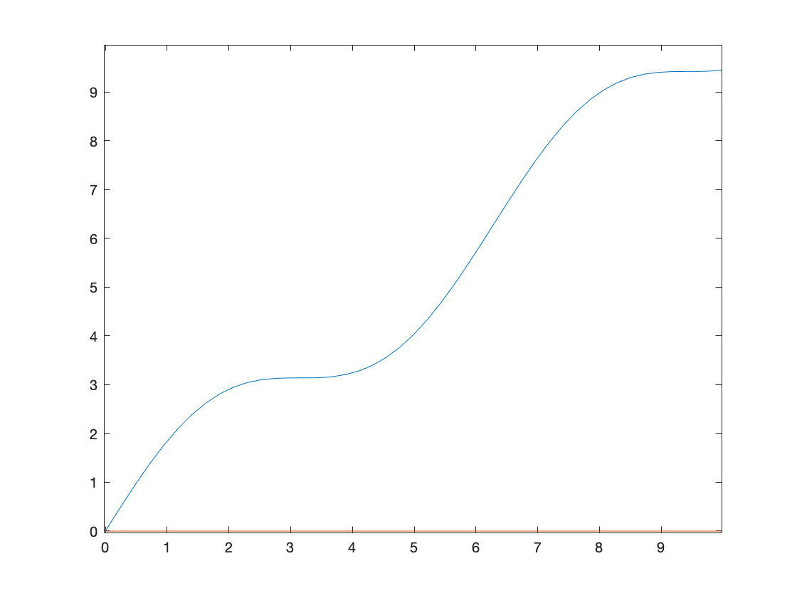

Demonstration
====

Consider solving a DAE

</a>

for </a>
with initial condition </a>.

## Without DAEPreprocessingToolbox
According to the [procedure](https://www.mathworks.com/help/symbolic/solve-differential-algebraic-equations.html) for solving DAEs provided by Symbolic Math Toolbox, first specify variables 

```matlab
syms x(t) y(t)
vars = [x, y];
```

and then define the equation system as follows:

```matlab
eqs = [
    -diff(x(t), t, 2)        - y(t) == sin(t)
     diff(x(t), t, 2) + x(t) + y(t) == t
];
```

Since procedures for DAEs in MALTAB cannot handle higher order systems, reduce `eqs` to the first-order system.

``` matlab
[eqs, vars] = reduceDifferentialOrder(eqs, vars)
```
>```
> eqs =
> 
>  - diff(Dxt(t), t) - sin(t) - y(t)
>  x(t) - t + y(t) + diff(Dxt(t), t)
>             Dxt(t) - diff(x(t), t)
> 
> 
> vars =
> 
>    x(t)
>    y(t)
>  Dxt(t)
>```

Next check if this system is of low-index.
``` matlab
isLowIndexDAE(eqs, vars)
```
>```
> ans =
>
>   logical
>
>    0
>```

Since [`isLowIndexDAE`](https://www.mathworks.com/help/symbolic/islowindexdae.html) reports that the system is of high-index, try to reduce the index by [`reduceDAEIndex`](https://www.mathworks.com/help/symbolic/reducedaeindex.html).
*However, this function yields a warning and returns the same DAE system without any modification.*

``` matlab
[eqs, vars] = reduceDAEIndex(eqs, vars)
```
>```
> Warning: Index of reduced DAEs is larger than 1.
> > In symengine
>   In mupadengine/evalin (line 127)
>   In mupadengine/feval (line 190)
>   In sym/reduceDAEIndex (line 98)
> 
> eqs =
> 
>  - diff(Dxt(t), t) - sin(t) - y(t)
>  x(t) - t + y(t) + diff(Dxt(t), t)
>             Dxt(t) - diff(x(t), t)
> 
> 
> vars =
> 
>    x(t)
>    y(t)
>  Dxt(t)
>```

This is because the DAE do no satisfy the validity condition of the Mattsson−Söderlind index reduction method (MS-method), which is implemented in [`reduceDAEIndex`](https://www.mathworks.com/help/symbolic/reducedaeindex.html).
Without index reduction, the DAE solver [`ode15i`](https://www.mathworks.com/help/matlab/ref/ode15i.html) cannot output a numerical solution for the system as it is index-2.

## Using DAEPreprocessingToolbox

DAEPreprocessingToolbox can help solving the DAE system.
First define the DAE in the same way as follows:

```matlab
syms x(t) y(t)
vars = [x, y];
eqs = [
    -diff(x(t), t, 2)        - y(t) == sin(t)
     diff(x(t), t, 2) + x(t) + y(t) == t
];
```

The applicability of the MS-method is determined by the nonsingularity of the *system Jacobian*, which can be computed by [`systemJacobian`](document.md#systemJacobian).

```matlab
D = systemJacobian(eqs, vars)
```
> ```
> D =
> 
> [ -1, -1]
> [  1,  1]
> ```

This is obviously singular.
So call [`preprocessDAE`](document.md#preprocessDAE) to modify the system so that it satisfies the validity condition.

```matlab
[eqs, vars] = preprocessDAE(eqs, vars)
```
> ```
> eqs =
>
>                        x(t) - sin(t) - t
>  x(t) - cos(t) + y(t) + diff(x(t), t, t)
>
>
> vars =
> 
>  x(t)
>  y(t)
> ```

Since the first equation is the sum of two equations in the original system, the resulting DAE is equivalent to the original one.
We can check the new DAE has a nonsingular system Jacobian as follows:

```matlab
D = systemJacobian(eqs, vars)
```
> ```
> D =
> 
> [ 1, 0]
> [ 1, 1]
> ```

Apply the MS-method to the resulting DAE.

```matlab
[eqs, vars] = reduceIndex(eqs, vars)
```
> ```
> eqs =
> 
>          x(t) - sin(t) - t
>  Dxtt(t) - t + x(t) + y(t)
>        Dxt(t) - cos(t) - 1
>           Dxtt(t) + sin(t)
> 
> 
> vars =
> 
>     x(t)
>     y(t)
>   Dxt(t)
>  Dxtt(t)
> ```

Let's check the low-indexness of the DAE.

```matlab
isLowIndex(eqs, vars)
```
>```
> ans =
>
>   logical
>
>    1
>```

Here, [`reduceIndex`](document.md/#reduceIndex) and [`isLowIndex`](document.md/#isLowIndex) are alternatives of [`reduceDAEIndex`](https://www.mathworks.com/help/symbolic/reducedaeindex.html) and [`isLowIndexDAE`](https://www.mathworks.com/help/symbolic/islowindexdae.html) in the Symbolic Math Toolbox, respectively, for higher-order DAE systems.

Now we can compute a numerical solution.

```matlab
F = daeFunction(eqs, vars);
y0est = zeros(4, 1);
yp0est = zeros(4, 1);
[y0, yp0] = decic(F, 0, y0est, [], yp0est, []);
[tSol, ySol] = ode15i(F, [0 10], y0, yp0);
plot(tSol, ySol(:, 1:2));
```



The numerical solution agrees with the following exact solution:

</a>